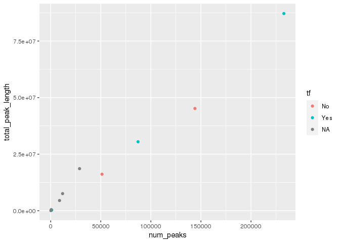
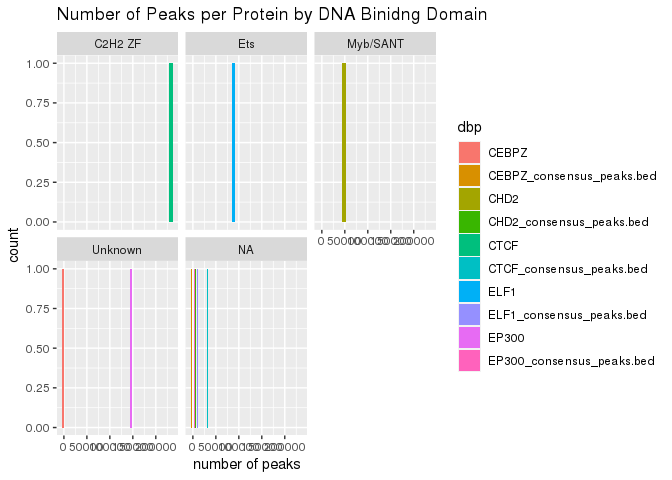
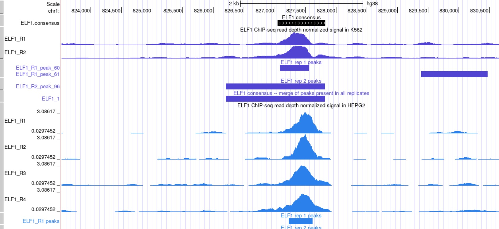
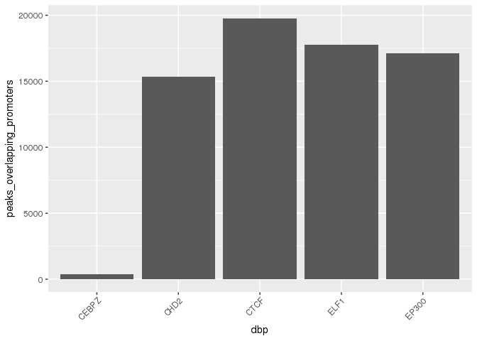
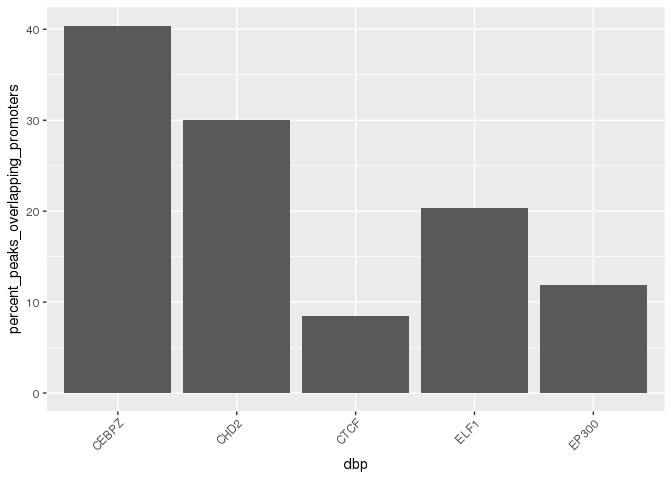
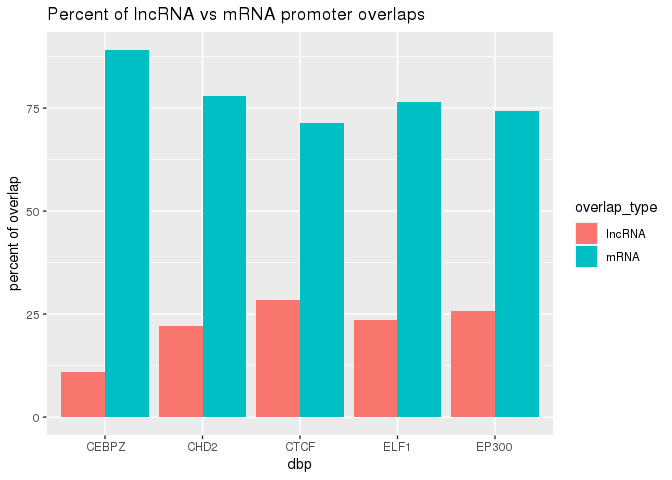
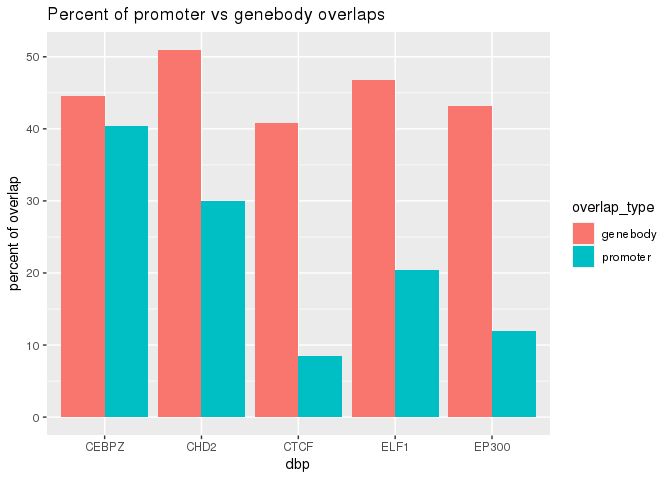
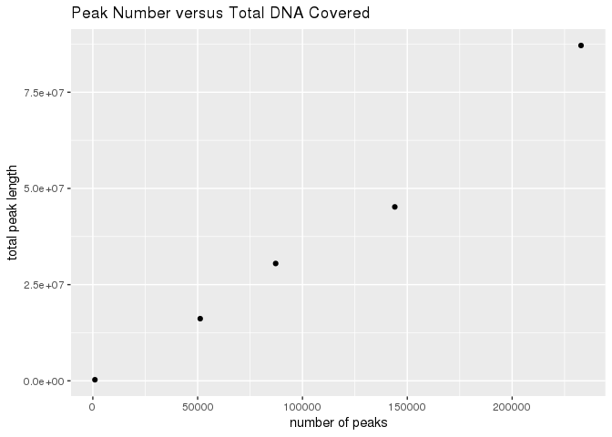
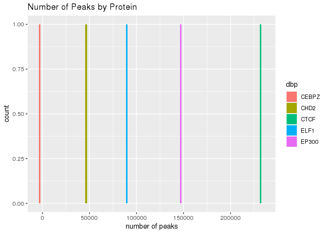

Class\_exercise
================
Emma Aldrich
3/19/2023

# load in peak files for each replicate of each protein

``` r
broadpeakfilepath <- "/scratch/Shares/rinnclass/CLASS_2023/2023_2_10_group3/group/results/bwa/mergedLibrary/macs/broadPeak/"


# print out a table of the number of peaks in each file:
peak_list <- import_peaks(consensus_file_path = broadpeakfilepath)

#create data frame of peaks in each file
peak_num <- sapply(peak_list, length) %>% as.data.frame(row.names = T)
```

    ## Warning in as.data.frame.integer(., row.names = T): 'row.names' is not a
    ## character vector of length 22 -- omitting it. Will be an error!

``` r
# label column
names(peak_num) <- c("num_peaks")

# make dbp name a col.
peak_num <- peak_num %>%
  rownames_to_column(var = "dbp") %>%
  separate(col = dbp,  into = c('dbp', 'replicate'), sep = "_")
```

# Create consensus peaks for each protein

``` r
dbps <- unique(sapply(names(peak_list), function(x) {
   unlist(strsplit(x, "_"))[1]
}))

consensus_list <- lapply(dbps, consensus_from_reduced, peak_list)
names(consensus_list) <- dbps

num_consensus_peaks <- sapply(consensus_list, length) %>% 
  as.data.frame() %>%
  rownames_to_column( var = "dbp") %>%
  dplyr::rename(number_consensus_peaks = ".")


# export consensus peaks to results folder
write_csv(num_consensus_peaks, "results/num_consensus_peaks_df.csv")
```

# Make my consensus peaks compatable with UCSC genome browser

``` r
# inputs to ucsc_formating
consensusFilePath <- "/scratch/Shares/rinnclass/CLASS_2023/2023_2_10_group3/group/results/bwa/mergedLibrary/macs/broadPeak/consensus/bed_files"
 
export_path <- "/scratch/Shares/rinnclass/CLASS_2023/emal2471/CLASS_2023/CLASSES/05_R_analyses/class_exercise/ucsc_consensus/"

ucsc_formating <- function(consensusFilePath = consensusFilePath, export_path = export_path) {
  
consensus_file_list <- list.files(consensusFilePath, full.names = T, pattern = ".bed")

dbps <- sapply(consensus_file_list, function(x) {
y <- str_extract(x, "([^\\/]+$)")
unlist(strsplit(y, "_"))[1]})

peaks <- lapply(consensus_file_list, read.table, col.names = c("chr", "start", "end", "name", "score", "strand"))

names(peaks) <- dbps
print(length(peaks))

canonical_chr <- c(paste0("chr", 1:22), "chrM", "chrX", "chrY")

peaks <- lapply(peaks, function(x) x %>% filter(chr %in% canonical_chr))

headers <- paste0("track type=bed name=", names(peaks))

new_filenames <- paste0(export_path, "/", names(peaks), ".bed")

for(i in 1:length(peaks)) {
  # Write the header line
  writeLines(headers[[i]], new_filenames[[i]])
  # Append the broadPeak table data
  write.table(peaks[[i]], new_filenames[[i]],
              sep = "\t", col.names = FALSE, row.names = FALSE,
              quote = FALSE, append = TRUE)
}
  return(c("done?"))
}

ucsc_formating(consensusFilePath = consensusFilePath, export_path = export_path)
```

    ## [1] 5

    ## [1] "done?"

# Use the annotations to determine if proteins are transcription factors. Start by loading in Gencode annotation of genomic features

``` r
load("/scratch/Shares/rinnclass/CLASS_2023/emal2471/CLASS_2023/CLASSES/05_R_analyses/01_peak_features/results/peak_features.RData")

# TF
url <- "https://www.cell.com/cms/10.1016/j.cell.2018.01.029/attachment/ede37821-fd6f-41b7-9a0e-9d5410855ae6/mmc2.xlsx"

destination_for_url <- "results/TF_annotations.xlsx"

download.file(url, destination_for_url)
```

# Read in DBP annotations as TF, then merge TF annotation file to num\_peaks\_df

``` r
#redx1::read_excel to import
options(warn=-1)
human_tfs <- readxl::read_excel("results/TF_annotations.xlsx",
                                sheet = 2, skip = 1)
```

    ## New names:
    ## • `` -> `...4`

``` r
# rename the 4th column to indicate if it is a TF.
names(human_tfs)[4] <- "is_tf"

# intersect gene names that are in our ChIP data and has TF identity.
length(which(tolower(num_peaks_df$dbp) %in% tolower(human_tfs$Name)))
```

    ## [1] 5

``` r
# to start merge: filter and grab the first 4 columns that match DBPs in num_peaks_df
human_tfs <- human_tfs[tolower(human_tfs$Name) %in% tolower(num_peaks_df$dbp), 1:4]


# adding new column names
names(human_tfs) <- c("ensembl_id",
                      "dbp",
                      "dbd",
                      "tf")

# the merge!
num_peaks_df <- merge(num_peaks_df, human_tfs, all.x = T)

# check for NAs
dim(num_peaks_df[is.na(num_peaks_df$tf),])
```

    ## [1]  5 12

``` r
# export
num_peaks_df <- num_peaks_df[,1:12]
write_csv(num_peaks_df, "results/num_peaks_df.csv")


#visualization
peak_num_versus_total_DNA_covered_by_tf_or_not <- ggplot(num_peaks_df, aes(x = num_peaks, y = total_peak_length, color = tf)) + geom_point() # + labs(x = "number of peaks", y = "total peak length", title = "Peak Number versus Total DNA Covered, Colored by Transcription Factor Status")

peak_num_versus_total_DNA_covered_by_tf_or_not
```

<!-- -->

``` r
#other visualization 
protein_peaks_by_DNA_binding_domain <- ggplot(num_peaks_df, aes(x = num_peaks, fill = dbp)) +
   geom_histogram(bins = 30, position = "dodge") + facet_wrap(dbd ~ .) + labs(x = "number of peaks", title = "Number of Peaks per Protein by DNA Binidng Domain")

protein_peaks_by_DNA_binding_domain
```

<!-- -->

# Now I want to compare a protein with a previous analysis

``` r
# USCS genome browser comparison for my ELF1 analysis, 2020 ELF1 analysis (purple), and 2021 ELF1 analysis (blue). The consensus peak from my analysis agrees with previous years!


```


# Determine how peaks for each protein overlap annotations of the genome. Start by finding the overlaps between my consensus peaks with promoters of lncRNA and mRNA promoters…

Let’s analyze how many peaks overlap different genomic features we can
start by creating a data frame of peak overlaps.

``` r
# Let's start with loading in the number of peaks each DBP has -- using length.

num_peaks_df <- data.frame("dbp" = names(consensus_peaks),
                           "num_peaks" = sapply(consensus_peaks, length))


# Now let's get the total amount of the genome covered by all the peaks for a given DBP.

num_peaks_df$total_peak_length <- sapply(consensus_peaks, function(x) sum(width(x)))
# nice we are getting results !
```

# …Then use count\_peaks\_per\_feature function to find overlaps

``` r
# counting promoter overlaps
promoter_peak_counts <- count_peaks_per_feature(lncrna_mrna_promoters, consensus_peaks, type = "counts")


num_peaks_df$peaks_overlapping_promoters <- rowSums(promoter_peak_counts)


write_csv(num_peaks_df, "results/num_peaks_df.csv")
```

## results:

\#1) What can you determine from these overlaps?

``` r
#much easier to visualize...which proteins have more overlaps with promoters? 

# making a separate num_peaks_df that doesn't have both the name of the protein and protein_consensus_peaks.bed as separate rows
num_peaks_df_for_plotting <- num_peaks_df %>%  filter(!row_number() %in% c(1,3,5,7,9))


peaks_overlapping_promoters_plot <- ggplot(num_peaks_df_for_plotting, aes(x = dbp,y = peaks_overlapping_promoters)) + geom_bar(stat = "identity")

POP_plot <- peaks_overlapping_promoters_plot + theme(axis.text.x = element_text(angle = 45, hjust = 1))

POP_plot
```

<!-- -->

``` r
# this suggests that CHD2, CTCF, ELF1, and EP300 have much more overlaps with promoters than CEBZ, but it's important to normalize it to the number of peaks

num_peaks_df$percent_peaks_overlapping_promoters <- (num_peaks_df$peaks_overlapping_promoters / num_peaks_df$num_peaks)*100

num_peaks_df_for_plotting <- num_peaks_df %>%  filter(!row_number() %in% c(1,3,5,7,9))


percent_peaks_overlapping_promoters_plot <- ggplot(num_peaks_df_for_plotting, aes(x = dbp,y = percent_peaks_overlapping_promoters)) + geom_bar(stat = "identity")

PPOP_plot <- percent_peaks_overlapping_promoters_plot + theme(axis.text.x = element_text(angle = 45, hjust = 1))

PPOP_plot
```

<!-- -->

``` r
#aha! So really, CEBPZ, the protein with the fewest total number of peaks overlapping promoters, actually has the highest peaks overlapping promoters by percentage 
```

# Now I want to compare the overlaps with lncRNA and mRNA promoters seperately

``` r
num_peaks_df$peaks_overlapping_lncrna_promoters <- rowSums(promoter_peak_counts[,lncrna_gene_ids])

# mrna promoter overlaps
num_peaks_df$peaks_overlapping_mrna_promoters <- rowSums(promoter_peak_counts[,mrna_gene_ids])

# Let's take a look.
write_csv(num_peaks_df, "results/num_peaks_df.csv")
```

## results:

# 1) What is the difference in overlaps between mRNA and lncRNA promoters

``` r
#Again, lets visualize (and pre-emptively look at it as a percentage)

num_peaks_df$percent_lncRNA_promoter_overlap <- (num_peaks_df$peaks_overlapping_lncrna_promoters / num_peaks_df$peaks_overlapping_promoters)*100

num_peaks_df$percent_mRNA_promoter_overlap <- (num_peaks_df$peaks_overlapping_mrna_promoters / num_peaks_df$peaks_overlapping_promoters)*100

num_peaks_df_for_plotting <- num_peaks_df %>%  filter(!row_number() %in% c(1,3,5,7,9))

percent_lncrna_promoter_overlap_df <- num_peaks_df_for_plotting[c(1,8)]
percent_lncrna_promoter_overlap_df$overlap_type <- c("lncRNA", "lncRNA", "lncRNA", "lncRNA", "lncRNA")
colnames(percent_lncrna_promoter_overlap_df)[2] ="percent"

percent_mrna_promoter_overlap_df <- num_peaks_df_for_plotting[c(1,9)]
percent_mrna_promoter_overlap_df$overlap_type <- c("mRNA", "mRNA", "mRNA", "mRNA", "mRNA")
colnames(percent_mrna_promoter_overlap_df)[2] ="percent"

lncRNA_vs_mRNA_df <- rbind(percent_lncrna_promoter_overlap_df, percent_mrna_promoter_overlap_df)

lncRNA_vs_mRNA_plot <- ggplot(lncRNA_vs_mRNA_df, aes(x=dbp, y = percent,fill= overlap_type)) +
  geom_col(position="dodge") +
  labs(x = "dbp", y = "percent of overlap", title = "Percent of lncRNA vs mRNA promoter overlaps")

lncRNA_vs_mRNA_plot
```

<!-- -->

``` r
#We see that all proteins have much higher percentages of mRNA promoters than lncRNA promoters in the total number of peaks overlapping promoters 
```

# Test if there is more binding over gene bodies than promoters (seperate lncRNA and mRNA gene bodies to find the overlaps)

``` r
# Finding overlaps with gene_bodies (will take a few minutes again)
# Note this takes 10-15 min
genebody_peak_counts <- count_peaks_per_feature(mrna_lncrna_genes, 
                                                consensus_peaks, 
                                                type = "counts")

# Now let's extract the overlaps the same way we did for promoters above

# All gene bodies
num_peaks_df$peaks_overlapping_genebody <- 
  rowSums(genebody_peak_counts)

# lncRNA gene bodies 
num_peaks_df$peaks_overlapping_lncrna_genebody <- rowSums(genebody_peak_counts[,lncrna_gene_ids])

# mRNA gene bodies
num_peaks_df$peaks_overlapping_mrna_genebody <- 
  rowSums(genebody_peak_counts[,mrna_gene_ids])


write_csv(num_peaks_df, "num_peaks_df.csv")
```

## results:

# 1) Do my proteins have more overlaps with promoters or genebodies?

``` r
#Time for another visualization!

num_peaks_df$percent_peaks_overlapping_genebody <- (num_peaks_df$peaks_overlapping_genebody / num_peaks_df$num_peaks)*100

num_peaks_df_for_plotting <- num_peaks_df %>%  filter(!row_number() %in% c(1,3,5,7,9))

#Lets make tidy data so I can make a grouped bar graph
percent_promoter_overlap_df <- num_peaks_df_for_plotting[c(1,5)]
percent_promoter_overlap_df$overlap_type <- c("promoter", "promoter", "promoter", "promoter", "promoter")
colnames(percent_promoter_overlap_df)[2] ="percent"

percent_genebody_overlap_df <- num_peaks_df_for_plotting[c(1,13)]
percent_genebody_overlap_df$overlap_type <- c("genebody", "genebody", "genebody", "genebody", "genebody")
colnames(percent_genebody_overlap_df)[2] ="percent"

promoter_vs_genebody_df <- rbind(percent_promoter_overlap_df, percent_genebody_overlap_df)

promoter_vs_genebody_plot <- ggplot(promoter_vs_genebody_df, aes(x=dbp, y = percent,fill= overlap_type)) +
  geom_col(position="dodge") +
  labs(x = "dbp", y = "percent of overlap", title = "Percent of promoter vs genebody overlaps")

promoter_vs_genebody_plot
```

<!-- -->

``` r
#Across all proteins tested, all have a higher percentage of peaks overlapping with genebodies than with promoters
```

# It is nice and all to find overlaps, but I am interested in how many proteins bind a specific promoter. I will use my handy “occurence” parameter in count\_peaks\_per\_feature

``` r
promoter_peak_occurence <- count_peaks_per_feature(lncrna_mrna_promoters, consensus_peaks, 
                                               type = "occurrence")

# double check that all lncrna & mrna genes are accounted for:
stopifnot(all(colnames(promoter_peak_occurence) == lncrna_mrna_promoters$gene_id))

# export
write.table(promoter_peak_occurence, "results/lncrna_mrna_promoter_peak_occurence_matrix.tsv")

# turn peak occurence into a data frame to make plotting easier: 

# First make sure promoter_peak_occurrence and lncrna_mrna_promoters are in the same order
stopifnot(all(colnames(promoter_peak_occurence) == lncrna_mrna_promoters$gene_id))

peak_occurence_df <- data.frame("gene_id" = colnames(promoter_peak_occurence),
                                "gene_name" = lncrna_mrna_promoters$gene_name,
                                "gene_type" = lncrna_mrna_promoters$gene_type,
                                "chr" = lncrna_mrna_promoters@seqnames,   
                                "1kb_up_tss_start" = lncrna_mrna_promoters@ranges@start,
                                "strand" = lncrna_mrna_promoters@strand,
                                "number_of_dbp" = colSums(promoter_peak_occurence))

# export
write_csv(peak_occurence_df, "results/peak_occurence_dataframe.csv")
```

## results: I find the max number of proteins on a promoter to be X

``` r
all_genes_peak_occurence_df <- peak_occurence_df[which.max(peak_occurence_df$number_of_dbp),]

#For the entire gencode dataset, the promoter RBM15 has the highest number of DNA binding proteins, 9. But lets filter peak_occurence_df for just the dbps of interest: 


CEBPZ_peak_occurence_df <- peak_occurence_df %>%  filter(gene_name == "CEBPZ") #1
CTCF_peak_occurence_df <- peak_occurence_df %>%  filter(gene_name == "CTCF") #6
CHD2_peak_occurence_df <- peak_occurence_df %>%  filter(gene_name == "CHD2") #5
ELF1_peak_occurence_df <- peak_occurence_df %>%  filter(gene_name == "ELF1") #2
EP300_peak_occurence_df <- peak_occurence_df %>%  filter(gene_name == "EP300") #6

#CTCF and EP300 have the most DNA binding proteins, 6
```

# Plotting results… is there a realtionship between peak number and total DNA covered?

``` r
peak_num_versus_total_DNA_covered <- ggplot(num_peaks_df_for_plotting, aes(x = num_peaks, 
                         y = total_peak_length)) +
  geom_point() + labs(x = "number of peaks", y = "total peak length", title = "Peak Number versus Total DNA Covered")

peak_num_versus_total_DNA_covered
```

<!-- -->

# Now I want to color my plot by whether the protein is a TF or not.

``` r
#moved this code to the transcription factor chunk above 
# peak_num_versus_total_DNA_covered_by_tf_or_not <- ggplot(num_peaks_df, aes(x = num_peaks, y = total_peak_length, color = tf)) + geom_point() # + labs(x = "number of peaks", y = "total peak length", title = "Peak Number versus Total DNA Covered, Colored by Transcription Factor Status")
# 
# peak_num_versus_total_DNA_covered_by_tf_or_not
```

# I want to make a histogram of the number of peaks for each of my proteins

``` r
peaks_by_protein <- ggplot(num_peaks_df_for_plotting, aes(x = num_peaks, fill = dbp)) +
   geom_histogram(bins = 30, position = "dodge")  + labs(x = "number of peaks", title = "Number of Peaks by Protein")

peaks_by_protein
```

<!-- -->

# Now I want to facet this by the type of DNA binding domain my protein has.

``` r
#moved this visualization to the transcription factor section 
# protein_peaks_by_DNA_binding_domain <- ggplot(num_peaks_df_for_plotting, aes(x = num_peaks, fill = dbp)) +
#    geom_histogram(bins = 30, position = "dodge") + facet_wrap(dbd ~ .) + labs(x = "number of peaks", title = "Number of Peaks per Protein by DNA Binidng Domain")
# 
# protein_peaks_by_DNA_binding_domain
```

# Cool now I am ready to send my result to my collaborator as a knitted document
