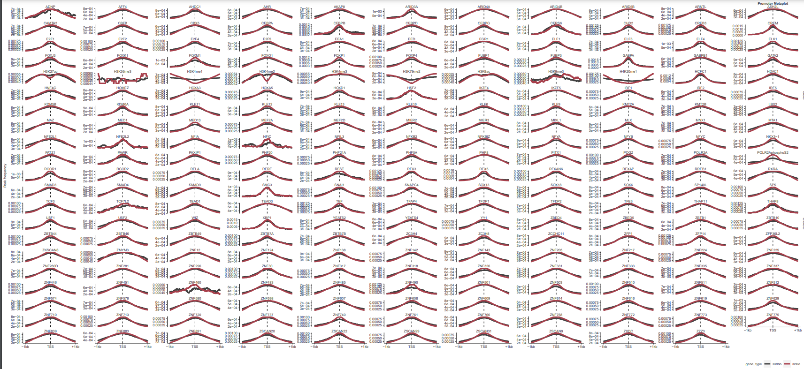
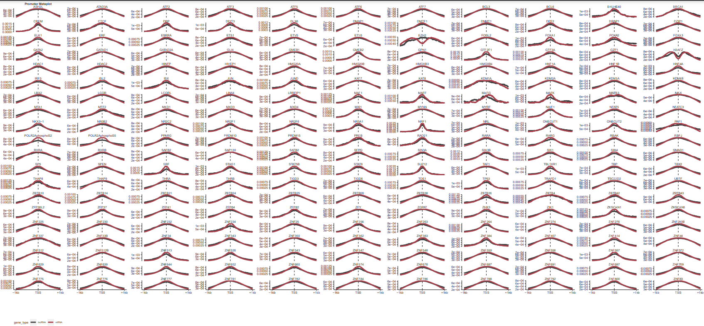

Aldrich\_final\_knit.rmd
================

\#Objective The ENCODE database is the largest ChIP-seq database
available and provides the opportunity for analysis of DNA binding
proteins (DBPs) in the same cell state. Here, we leverage ENCODE data to
ask questions about and make comparisons between 430 DNA DBPs. Some
guiding questions for this project include:

1.  What are the number of peaks and genome coverage for each DBP?

2.  What are the binding preferences for promoters, gene-bodies and
    intergenic genomic regions?

3.  What are the similarities and differences across DBPs based on their
    genome-wide binding profiles genome-wide?

\#Methods Analysis will take place over five steps: 1. Create Consensus
Peaks 2. Plot Consensus Peaks 3. Cluster Peaks 4. RNAseq Analysis 4.1:
Compare Binding and Expression 4.2: Superbinder Expression

\#Step 1: Load Consensus Peaks Annotation File and Create Consensus
Peaks

``` r
load("/scratch/Shares/rinnclass/CLASS_2023/emal2471/CLASS_2023/CLASSES/06_final_going_global/analysis/results/peak_features.RData", verbose = T)
```

    ## Loading objects:
    ##   filtered_consensus_list
    ##   gencode_genes
    ##   lncrna_gene_ids
    ##   mrna_gene_ids
    ##   num_peaks_df
    ##   peak_occurence_df
    ##   promoter_peak_occurrence_matrix
    ##   lncrna_mrna_promoters
    ##   mrna_lncrna_genes

``` r
load("/scratch/Shares/rinnclass/CLASS_2023/emal2471/CLASS_2023/CLASSES/06_final_going_global/analysis/results/filtered_consensus_list.RData")
```

\#Step 2: Plot Consensus Peaks

## Peaks per dbp

``` r
# First let's look at a histogram of peak#/DBP
 ggplot(num_peaks_df, aes(x = num_peaks)) + 
  geom_histogram(bins = 70)
```

<!-- -->

``` r
# saving
ggsave("figures/num_peaks_hist.pdf")
```

\#\#\#Result: After filtering for proteins that have at least 1000
peaks, we will move forward with 430 DBPs

## Plot num\_peaks versus genome coverage.

``` r
ggplot(num_peaks_df, aes(x = num_peaks, y = total_peak_length)) +
  geom_point() + 
  geom_smooth(method = "gam", se = TRUE, color = "black", lty = 2)+
  ylab("BP covered") +
  xlab("Number of peaks") +
  ggtitle("Peak count vs. total bases covered")
```

<!-- -->

``` r
# saving 
ggsave("figures/peak_num_vs_coverage.pdf")
```

\#\#\#Result: There is a linear relationship between number of peaks and
total coverage

## Plot number of peaks on promoters

``` r
ggplot(num_peaks_df,
       aes(x = num_peaks, y = peaks_overlapping_promoters)) +
  xlab("Peaks per DBP") +
  ylab("Number of peaks overlapping promoters") +
  ggtitle("Relationship Between Number of DBP Peaks and Promoter Overlaps")+
  geom_point() +
  geom_abline(slope = 1, linetype="dashed") +
  geom_smooth(method = "lm", se=FALSE, formula = 'y ~ x',
              color = "#a8404c") +
  ylim(0,60100) +
  xlim(0,60100)
```

<!-- -->

``` r
ggsave("figures/peak_num_vs_promoter_coverage.pdf")

# peaks you stop increasing binding to promoters.
# maybe it leaks into the gene body let's check
```

\#\#\#Result: As the number of peaks per DBP increases, the number of
peaks overlapping promoters starts to level off around 20,000. This
behavior suggests binding saturation.

## Quantify peak coverage on gene bodies

``` r
ggplot(num_peaks_df,
       aes(x = num_peaks, y = peaks_overlapping_genebody)) +
  xlab("Peaks per DBP") +
  ylab("Number of peaks overlapping genes") +
  ggtitle("Relationship Between Number of DBP Peaks and Gene Body Overlaps")+
  geom_point() +
  geom_abline(slope = 1, linetype="dashed") +
  geom_smooth(method = "lm", se=F, formula = 'y ~ x',
              color = "#a8404c") +
  ylim(0,60100) +
  xlim(0,60100)
```

<!-- -->

``` r
# saving
ggsave("figures/4_peak_num_vs_gene_body_coverage.pdf")
```

\#\#\#Result: The linear relationship between peaks per DBP and number
of peaks overlapping with genes supports that gene bodies explain almost
all the places of binding in the genome.

## Plot density of binding events (DBPs bound per promoter)

``` r
ggplot(peak_occurence_df, aes(x = number_of_dbp)) +
geom_density(alpha = 0.2, color = "#424242", fill = "#424242") +
  theme_paperwhite() +
  xlab(expression("Number of DBPs")) +
  ylab(expression("Density")) +
  ggtitle("Promoter binding events",
          subtitle = "mRNA and lncRNA genes") 
```

<!-- -->

``` r
# saving
ggsave("figures/num_binding_events_per_promoter.pdf")
```

\#\#\#Result: There are two types of promoter binding, evident by the
two peaks in density, “normal” and “superbinders”. Normal promoters have
\~100DBPs and the superbinders have \~200DBPs. Subsequent analysis is
needs to analyze if these superbinders interact with mRNA or lncRNA

## First compare lncRNA versus mRNA promoter binding for all promoter types (normal and superbinders)

``` r
num_peaks_dfl <- num_peaks_df %>%
  dplyr::select(-peaks_overlapping_promoters) %>%
  pivot_longer(cols = peaks_overlapping_lncrna_promoters:peaks_overlapping_mrna_promoters,
               names_to = "gene_type",
               values_to = "peaks_overlapping_promoters") %>%
  mutate(gene_type = gsub("peaks_overlapping_", "", gene_type))

# plotting
ggplot(num_peaks_dfl, aes(x = num_peaks, y = peaks_overlapping_promoters, 
                         col = gene_type)) +
         geom_point() +
         geom_abline(slope = 1, linetype="dashed") +
  geom_smooth(method = "lm", se = FALSE, formula = "y ~ x") + 
  scale_color_manual(values = c("#a8404c", "#424242"))+
  xlab("Peaks per DBP") +
  ylab("Peaks Overlapping Promoters") +
  ggtitle("Number of DBP Peaks and Promoter Overlaps")
```

<!-- -->

``` r
# saving
ggsave("figures/peaks_overlaps_relationship_by_gene_type.pdf", height = 5, width = 8)
```

\#\#\#Results: \#\#\#TODO: interpret \#\#\#

## Now filter peak\_occurence\_df for superbinders and compare again mRNA vs lncRNA

``` r
superbinders_df <- filter(peak_occurence_df, number_of_dbp > 185)

lnc_superbinders <- filter(superbinders_df, gene_type == "lncRNA")
percent_lnc_superbinders <- (nrow(lnc_superbinders) / nrow(superbinders_df))*100

mRNA_superbinders <- filter(superbinders_df, gene_type == "protein_coding")
percent_mRNA_superbinders <- (nrow(mRNA_superbinders) / nrow(superbinders_df))*100
```

\#\#\#Results: \~22% of superbinders bind to lncRNA, while \~79% of
superbinders bind to mRNA.

## Plot promoters without binding events

``` r
unbound_promoters <- peak_occurence_df %>% 
  filter(peak_occurence_df$number_of_dbp < 1)

percent_unbound <- (nrow(unbound_promoters) / nrow(peak_occurence_df))*100

write_csv(unbound_promoters, "results/unbound_promoters.csv")
```

\#\#\#Results: 9,448 promoters do not have binding events. This
represents \~25% of all promoters.

\#Step 3: Cluster Peaks

\#\#Load Promoter Peak Occurence df

``` r
#load("/scratch/Shares/rinnclass/CLASS_2023/emal2471/CLASS_2023/CLASSES/06_final_going_global/analysis/results/peak_occurence_dataframe.RData")

#not necessary bc promoter_peak_occurence_df is already in peak_features.RData, but another source for peak_occurence_df 
```

\#\#Create distance matrix & dendrogram

``` r
# creating distance matrix
peak_occurence_dist <- dist(promoter_peak_occurrence_matrix, method = "binary")

# clustering distance values
bin_hier <- hclust(peak_occurence_dist, method = "complete")

# Dendrogram of binding profiles by promoter (not binding profile - below)
ggdendro::ggdendrogram(bin_hier, rotate = FALSE,  size = 3,
                       theme_dendro = TRUE) +
   coord_flip() +
   scale_y_continuous() +
   scale_x_continuous(position = "top") +
   scale_x_continuous(breaks = seq_along(bin_hier$labels[bin_hier$order]),
             labels = bin_hier$labels[bin_hier$order], position = "top",
             expand = c(0,0)) +
   theme(axis.text.x = element_text(angle = 90, hjust  = 1)) +
   theme(axis.text.y = element_text(angle = 0,hjust = 1)) +
   scale_y_reverse(expand = c(0.01, 0)) +
   theme(
     plot.background = element_blank(),
     panel.grid.major = element_blank(),
   panel.grid.minor = element_blank(),
     panel.border = element_blank()
   )
```

<!-- -->

``` r
ggsave("figures/promoter_overlap_dendrogram.pdf")
```

# Using profile\_tss for all 430 DBPs

# ! this takes \~45 min !

``` r
# establishing DF
metaplot_df <- data.frame(x = integer(), dens = numeric(), dbp = character())

# for loop to populate DF 
for(i in 1:length(filtered_consensus_list)) {
  print(names(filtered_consensus_list)[[i]])
  tmp_df <- profile_tss(filtered_consensus_list[[i]], lncrna_mrna_promoters)
  tmp_df$dbp <- names(filtered_consensus_list)[[i]]
  metaplot_df <- bind_rows(metaplot_df, tmp_df)
  
}
```

    ## [1] "ADNP"
    ## [1] "AFF4"
    ## [1] "AHDC1"
    ## [1] "AHR"
    ## [1] "AKAP8"
    ## [1] "ARID3A"
    ## [1] "ARID4A"
    ## [1] "ARID4B"
    ## [1] "ARID5B"
    ## [1] "ARNTL"
    ## [1] "ASH2L"
    ## [1] "ATAD3A"
    ## [1] "ATF2"
    ## [1] "ATF3"
    ## [1] "ATF5"
    ## [1] "ATF6"
    ## [1] "ATF7"
    ## [1] "BCL3"
    ## [1] "BCL6"
    ## [1] "BHLHE40"
    ## [1] "BRCA1"
    ## [1] "CAMTA2"
    ## [1] "CBFB"
    ## [1] "CBX5"
    ## [1] "CEBPA"
    ## [1] "CEBPB"
    ## [1] "CEBPD"
    ## [1] "CEBPG"
    ## [1] "CERS6"
    ## [1] "CHD2"
    ## [1] "CREB3"
    ## [1] "CREM"
    ## [1] "CTCF"
    ## [1] "DBP"
    ## [1] "DDIT3"
    ## [1] "DLX6"
    ## [1] "DMAP1"
    ## [1] "DMTF1"
    ## [1] "DNMT1"
    ## [1] "DPF2"
    ## [1] "DRAP1"
    ## [1] "DZIP1"
    ## [1] "E2F1"
    ## [1] "E2F2"
    ## [1] "E2F4"
    ## [1] "E2F5"
    ## [1] "EEA1"
    ## [1] "EED"
    ## [1] "EGR1"
    ## [1] "ELF1"
    ## [1] "ELF3"
    ## [1] "ELF4"
    ## [1] "ELK1"
    ## [1] "ERF"
    ## [1] "ESRRA"
    ## [1] "ETS1"
    ## [1] "ETV5"
    ## [1] "ETV6"
    ## [1] "EZH2"
    ## [1] "FOSL2"
    ## [1] "FOXA1"
    ## [1] "FOXA2"
    ## [1] "FOXA3"
    ## [1] "FOXJ3"
    ## [1] "FOXK1"
    ## [1] "FOXM1"
    ## [1] "FOXO1"
    ## [1] "FOXP1"
    ## [1] "FOXP4"
    ## [1] "FUBP1"
    ## [1] "FUBP3"
    ## [1] "GABPA"
    ## [1] "GABPB1"
    ## [1] "GATA2"
    ## [1] "GATAD1"
    ## [1] "GATAD2A"
    ## [1] "GLI4"
    ## [1] "GMEB1"
    ## [1] "GMEB2"
    ## [1] "GPN1"
    ## [1] "GTF2F1"
    ## [1] "GTF3A"
    ## [1] "GZF1"
    ## [1] "H2AFZ"
    ## [1] "H3K27ac"
    ## [1] "H3K36me3"
    ## [1] "H3K4me1"
    ## [1] "H3K4me2"
    ## [1] "H3K4me3"
    ## [1] "H3K79me2"
    ## [1] "H3K9ac"
    ## [1] "H3K9me3"
    ## [1] "H4K20me1"
    ## [1] "HCFC1"
    ## [1] "HDAC1"
    ## [1] "HDAC2"
    ## [1] "HINFP"
    ## [1] "HIVEP1"
    ## [1] "HMG20A"
    ## [1] "HMG20B"
    ## [1] "HMGXB3"
    ## [1] "HMGXB4"
    ## [1] "HNF1A"
    ## [1] "HNF1B"
    ## [1] "HNF4A"
    ## [1] "HNF4G"
    ## [1] "HOMEZ"
    ## [1] "HOXA3"
    ## [1] "HOXA5"
    ## [1] "HOXD1"
    ## [1] "HSF2"
    ## [1] "IKZF4"
    ## [1] "IKZF5"
    ## [1] "IRF1"
    ## [1] "IRF2"
    ## [1] "IRF5"
    ## [1] "ISL2"
    ## [1] "ISX"
    ## [1] "JUN"
    ## [1] "JUND"
    ## [1] "KAT7"
    ## [1] "KAT8"
    ## [1] "KDM1A"
    ## [1] "KDM2A"
    ## [1] "KDM3A"
    ## [1] "KDM4B"
    ## [1] "KDM5B"
    ## [1] "KDM6A"
    ## [1] "KLF11"
    ## [1] "KLF12"
    ## [1] "KLF13"
    ## [1] "KLF16"
    ## [1] "KLF6"
    ## [1] "KLF9"
    ## [1] "KMT2A"
    ## [1] "KMT2B"
    ## [1] "LBX2"
    ## [1] "LCOR"
    ## [1] "LCORL"
    ## [1] "LIN54"
    ## [1] "LRRFIP1"
    ## [1] "MAF1"
    ## [1] "MAFF"
    ## [1] "MAFG"
    ## [1] "MAFK"
    ## [1] "MATR3"
    ## [1] "MAX"
    ## [1] "MAZ"
    ## [1] "MED1"
    ## [1] "MED13"
    ## [1] "MEF2A"
    ## [1] "MEF2D"
    ## [1] "MIER2"
    ## [1] "MIER3"
    ## [1] "MIXL1"
    ## [1] "MLX"
    ## [1] "MNX1"
    ## [1] "MTA1"
    ## [1] "MTF2"
    ## [1] "MXD1"
    ## [1] "MXD3"
    ## [1] "MXD4"
    ## [1] "MXI1"
    ## [1] "MYNN"
    ## [1] "MYRF"
    ## [1] "NAIF1"
    ## [1] "NFAT5"
    ## [1] "NFATC3"
    ## [1] "NFE2L1"
    ## [1] "NFE2L2"
    ## [1] "NFIA"
    ## [1] "NFIC"
    ## [1] "NFIL3"
    ## [1] "NFKB2"
    ## [1] "NFKBIZ"
    ## [1] "NFYA"
    ## [1] "NFYB"
    ## [1] "NFYC"
    ## [1] "NKX3-1"
    ## [1] "NR0B2"
    ## [1] "NR2C2"
    ## [1] "NR2F1"
    ## [1] "NR2F6"
    ## [1] "NR5A1"
    ## [1] "NRF1"
    ## [1] "NRL"
    ## [1] "ONECUT1"
    ## [1] "ONECUT2"
    ## [1] "PAF1"
    ## [1] "PATZ1"
    ## [1] "PAWR"
    ## [1] "PAXIP1"
    ## [1] "PHF20"
    ## [1] "PHF21A"
    ## [1] "PHF5A"
    ## [1] "PHF8"
    ## [1] "PITX1"
    ## [1] "POGZ"
    ## [1] "POLR2A"
    ## [1] "POLR2AphosphoS2"
    ## [1] "POLR2AphosphoS5"
    ## [1] "PPARG"
    ## [1] "PRDM10"
    ## [1] "PRDM15"
    ## [1] "PREB"
    ## [1] "RAD21"
    ## [1] "RARA"
    ## [1] "RARG"
    ## [1] "RBAK"
    ## [1] "RBPJ"
    ## [1] "RCOR1"
    ## [1] "RCOR2"
    ## [1] "RELA"
    ## [1] "RERE"
    ## [1] "REST"
    ## [1] "RFX3"
    ## [1] "RFX5"
    ## [1] "RFXANK"
    ## [1] "RFXAP"
    ## [1] "RREB1"
    ## [1] "RXRA"
    ## [1] "RXRB"
    ## [1] "SAFB2"
    ## [1] "SAP130"
    ## [1] "SATB2"
    ## [1] "SFPQ"
    ## [1] "SIN3A"
    ## [1] "SIN3B"
    ## [1] "SIX1"
    ## [1] "SIX4"
    ## [1] "SMAD1"
    ## [1] "SMAD3"
    ## [1] "SMAD4"
    ## [1] "SMAD9"
    ## [1] "SMC3"
    ## [1] "SNAI1"
    ## [1] "SNAPC4"
    ## [1] "SOX13"
    ## [1] "SOX18"
    ## [1] "SOX6"
    ## [1] "SP140L"
    ## [1] "SP5"
    ## [1] "SPEN"
    ## [1] "SRF"
    ## [1] "STAG1"
    ## [1] "STAT5B"
    ## [1] "STAT6"
    ## [1] "SUZ12"
    ## [1] "TAF1"
    ## [1] "TBL1XR1"
    ## [1] "TBP"
    ## [1] "TBX2"
    ## [1] "TCF3"
    ## [1] "TCF7L2"
    ## [1] "TEAD1"
    ## [1] "TEAD3"
    ## [1] "TEF"
    ## [1] "TFAP4"
    ## [1] "TFDP1"
    ## [1] "TFDP2"
    ## [1] "TFE3"
    ## [1] "THAP11"
    ## [1] "THAP8"
    ## [1] "THAP9"
    ## [1] "THRA"
    ## [1] "THRB"
    ## [1] "TIGD3"
    ## [1] "TIGD6"
    ## [1] "TOE1"
    ## [1] "TP53"
    ## [1] "TRAFD1"
    ## [1] "TSC22D2"
    ## [1] "UBTF"
    ## [1] "USF1"
    ## [1] "USF2"
    ## [1] "WIZ"
    ## [1] "XBP1"
    ## [1] "YEATS2"
    ## [1] "YEATS4"
    ## [1] "YY1"
    ## [1] "ZBED4"
    ## [1] "ZBED5"
    ## [1] "ZBTB1"
    ## [1] "ZBTB10"
    ## [1] "ZBTB14"
    ## [1] "ZBTB21"
    ## [1] "ZBTB24"
    ## [1] "ZBTB25"
    ## [1] "ZBTB26"
    ## [1] "ZBTB38"
    ## [1] "ZBTB39"
    ## [1] "ZBTB4"
    ## [1] "ZBTB42"
    ## [1] "ZBTB43"
    ## [1] "ZBTB44"
    ## [1] "ZBTB46"
    ## [1] "ZBTB49"
    ## [1] "ZBTB7A"
    ## [1] "ZBTB7B"
    ## [1] "ZC3H4"
    ## [1] "ZC3H8"
    ## [1] "ZCCHC11"
    ## [1] "ZFP1"
    ## [1] "ZFP14"
    ## [1] "ZFP36L2"
    ## [1] "ZFP37"
    ## [1] "ZFP41"
    ## [1] "ZFP64"
    ## [1] "ZFP82"
    ## [1] "ZFY"
    ## [1] "ZGPAT"
    ## [1] "ZHX3"
    ## [1] "ZIK1"
    ## [1] "ZKSCAN1"
    ## [1] "ZKSCAN5"
    ## [1] "ZKSCAN8"
    ## [1] "ZMYM3"
    ## [1] "ZNF12"
    ## [1] "ZNF124"
    ## [1] "ZNF138"
    ## [1] "ZNF142"
    ## [1] "ZNF143"
    ## [1] "ZNF205"
    ## [1] "ZNF217"
    ## [1] "ZNF224"
    ## [1] "ZNF225"
    ## [1] "ZNF230"
    ## [1] "ZNF232"
    ## [1] "ZNF234"
    ## [1] "ZNF25"
    ## [1] "ZNF256"
    ## [1] "ZNF263"
    ## [1] "ZNF264"
    ## [1] "ZNF274"
    ## [1] "ZNF276"
    ## [1] "ZNF280B"
    ## [1] "ZNF280D"
    ## [1] "ZNF281"
    ## [1] "ZNF296"
    ## [1] "ZNF30"
    ## [1] "ZNF317"
    ## [1] "ZNF318"
    ## [1] "ZNF326"
    ## [1] "ZNF331"
    ## [1] "ZNF333"
    ## [1] "ZNF335"
    ## [1] "ZNF337"
    ## [1] "ZNF33B"
    ## [1] "ZNF34"
    ## [1] "ZNF343"
    ## [1] "ZNF350"
    ## [1] "ZNF362"
    ## [1] "ZNF383"
    ## [1] "ZNF384"
    ## [1] "ZNF407"
    ## [1] "ZNF414"
    ## [1] "ZNF44"
    ## [1] "ZNF446"
    ## [1] "ZNF451"
    ## [1] "ZNF460"
    ## [1] "ZNF483"
    ## [1] "ZNF485"
    ## [1] "ZNF490"
    ## [1] "ZNF501"
    ## [1] "ZNF503"
    ## [1] "ZNF510"
    ## [1] "ZNF511"
    ## [1] "ZNF512"
    ## [1] "ZNF512B"
    ## [1] "ZNF513"
    ## [1] "ZNF526"
    ## [1] "ZNF543"
    ## [1] "ZNF547"
    ## [1] "ZNF548"
    ## [1] "ZNF550"
    ## [1] "ZNF556"
    ## [1] "ZNF557"
    ## [1] "ZNF572"
    ## [1] "ZNF574"
    ## [1] "ZNF576"
    ## [1] "ZNF580"
    ## [1] "ZNF598"
    ## [1] "ZNF607"
    ## [1] "ZNF608"
    ## [1] "ZNF609"
    ## [1] "ZNF614"
    ## [1] "ZNF616"
    ## [1] "ZNF619"
    ## [1] "ZNF629"
    ## [1] "ZNF639"
    ## [1] "ZNF644"
    ## [1] "ZNF652"
    ## [1] "ZNF660"
    ## [1] "ZNF674"
    ## [1] "ZNF678"
    ## [1] "ZNF687"
    ## [1] "ZNF691"
    ## [1] "ZNF697"
    ## [1] "ZNF709"
    ## [1] "ZNF710"
    ## [1] "ZNF713"
    ## [1] "ZNF720"
    ## [1] "ZNF737"
    ## [1] "ZNF740"
    ## [1] "ZNF761"
    ## [1] "ZNF766"
    ## [1] "ZNF768"
    ## [1] "ZNF772"
    ## [1] "ZNF773"
    ## [1] "ZNF775"
    ## [1] "ZNF776"
    ## [1] "ZNF777"
    ## [1] "ZNF781"
    ## [1] "ZNF782"
    ## [1] "ZNF784"
    ## [1] "ZNF786"
    ## [1] "ZNF788"
    ## [1] "ZNF792"
    ## [1] "ZNF800"
    ## [1] "ZNF83"
    ## [1] "ZNF839"
    ## [1] "ZNF883"
    ## [1] "ZNF891"
    ## [1] "ZSCAN20"
    ## [1] "ZSCAN22"
    ## [1] "ZSCAN29"
    ## [1] "ZSCAN31"
    ## [1] "ZSCAN9"
    ## [1] "ZXDC"
    ## [1] "ZZZ3"

``` r
# saving
saveRDS(metaplot_df, "results/metaplot_df_final.rds")
```

## Create distance matrix of binding profile correlations

``` r
metaplot_filtered_matrix <- metaplot_df %>% 
  pivot_wider(names_from = x, values_from = dens) %>%
  column_to_rownames("dbp") %>%
  as.matrix()
mm_scaled <- t(scale(t(metaplot_filtered_matrix)))
metaplot_hclust <- hclust(dist(mm_scaled), method = "complete")

# plotting relationship between binding profiles
plot(metaplot_hclust)
```

<!-- -->

``` r
pdf("figures/tss_profile_dendrogram.pdf", height = 10, width = 27)
par(cex=0.3)
plot(metaplot_hclust)
dev.off()
```

    ## png 
    ##   2

## Make heat map of binding profile over +/- 1kb TSS window

``` r
# setting up PDF function for saving
pdf("figures/tss_profile_heatmap.pdf", height = 35, width = 10)

# complex heatmap of mm_scaled
Heatmap(mm_scaled, cluster_columns = FALSE, border = TRUE, use_raster = TRUE, column_gap = unit(0, "mm"), row_names_gp = gpar(fontsize = 7))
graphics.off()
```

## Cluster based on lncRNA

``` r
# load lncRNA promoters annotations 
#lncrna_mrna_promoters <- rtracklayer::import("/scratch/Shares/rinnclass/CLASS_2023/emal2471/CLASS_2023/CLASSES/05_R_analyses/01_peak_features/results/gene_annotations/lncrna_mrna_promoters.gtf")

# split into lncRNA and mRNA
lncrna_promoters <- lncrna_mrna_promoters[lncrna_mrna_promoters$gene_type == "lncRNA"]

mrna_promoters <- lncrna_mrna_promoters[lncrna_mrna_promoters$gene_type == "protein_coding"]

# separate peak_occurrence_matrix in lncRNA and mRNA
lncrna_peak_occurence <- promoter_peak_occurrence_matrix[,lncrna_promoters$gene_id]

# hclust:
bin_hier_lncrna <- hclust(dist(lncrna_peak_occurence, method = "binary"))

# plot:
ggdendro::ggdendrogram(bin_hier_lncrna, rotate = T,  size = 3)
```

<!-- -->

``` r
# save 
ggsave("figures/lncrna_hclust_binary_dist.pdf", height = 49, width = 6)
```

## Cluster based on mRNA

``` r
mrna_peak_occurence <- promoter_peak_occurrence_matrix[,mrna_promoters$gene_id]

# get the distance matrix for only mRNA promoters  
bin_hier_mrna <- hclust(dist(mrna_peak_occurence, method = "binary"))
 
# plot with ggdendro
ggdendro::ggdendrogram(bin_hier, rotate = TRUE,  size = 3)
```

<!-- -->

``` r
# save
ggsave("figures/mrna_hclust_binary_dist.pdf", height = 44, width = 6)
```

## Investigate patterns of ChIP binding profiles relative to TSS: separate into several clusters

``` r
# Need to know how many DBPs have different patterns.
# Using guess and check, after 6 we get a new group of 10 (after that not much changes)
clusters <- cutree(metaplot_hclust, k=6)
table(clusters)
```

    ## clusters
    ##   1   2   3   4   5   6 
    ## 281 130  10   5   1   3

``` r
# plot cluster 1
dev.new()
pdf("figures/cluster_1_heatmap.pdf", height = 35, width = 10)

Heatmap(mm_scaled[clusters == 1,], cluster_columns = FALSE, border = TRUE, use_raster = TRUE, column_gap = unit(0, "mm"), row_names_gp = gpar(fontsize = 7))
graphics.off()


# cluster 2
dev.new()
pdf("figures/cluster_2_heatmap.pdf", height = 35, width = 10)

Heatmap(mm_scaled[clusters == 2,], cluster_columns = FALSE, border = TRUE, use_raster = TRUE, column_gap = unit(0, "mm"), row_names_gp = gpar(fontsize = 7))
graphics.off()


# cluster 3
dev.new()
pdf("figures/cluster_3_heatmap.pdf", height = 35, width = 10)

Heatmap(mm_scaled[clusters == 3,], cluster_columns = FALSE, border = TRUE, use_raster = TRUE, column_gap = unit(0, "mm"), row_names_gp = gpar(fontsize = 7))
graphics.off()


# cluster 4
dev.new()
pdf("figures/cluster_4_heatmap.pdf", height = 35, width = 10)

Heatmap(mm_scaled[clusters == 4,], cluster_columns = FALSE, border = TRUE, use_raster = TRUE, column_gap = unit(0, "mm"), row_names_gp = gpar(fontsize = 7))
graphics.off()

# looks like TSS depletion and histone mods

# cluster 5 only 1 DBP
names(clusters[5])
```

    ## [1] "AKAP8"

``` r
#AKAP8

# cluster 6
dev.new()
pdf("figures/cluster_6_heatmap.pdf", height = 35, width = 10)
Heatmap(mm_scaled[clusters == 6,], cluster_columns = FALSE, border = TRUE, use_raster = TRUE, column_gap = unit(0, "mm"), row_names_gp = gpar(fontsize = 7))
graphics.off()
```

\#\#\#Results: In cluster 1, TSS is enriched a bit broader than cluster
2. Cluster 3 has very narrow binding over TSS relative to clusters 1 and
2. Cluster 4 has evidence of TSS depletion, potentially due to
histones/histone modifications. Cluster 5 is less interesting because it
only contains 1 DBP, AKAP8. Cluster 6 is also small with only 3 DBPs,
and like cluster 4 shows TSS depletion/histone modifications.

# establishing lncRNA and mRNA promoters (+/- 1kb)

``` r
# creating promoters just in case:
lncrna_promoters <- lncrna_mrna_promoters[lncrna_mrna_promoters$gene_type == "lncRNA"]
mrna_promoters <- lncrna_mrna_promoters[lncrna_mrna_promoters$gene_type == "protein_coding"]
```

## Make metaplots for each DBP by lncRNA and mRNA promoters

``` r
#setting up lncrna DF.
lncrna_metaplot_df <- data.frame(x = integer(), dens = numeric(), dbp = character())


# for loop to populate DF with overlap density in lncrna promoters
for(i in 1:length(filtered_consensus_list)) {
  print(names(filtered_consensus_list)[[i]])
  tmp_df <- profile_tss(filtered_consensus_list[[i]], lncrna_mrna_promoters = lncrna_promoters)
  tmp_df$dbp <- names(filtered_consensus_list)[[i]]
  lncrna_metaplot_df <- bind_rows(lncrna_metaplot_df, tmp_df)
  
}
```

    ## [1] "ADNP"
    ## [1] "AFF4"
    ## [1] "AHDC1"
    ## [1] "AHR"
    ## [1] "AKAP8"
    ## [1] "ARID3A"
    ## [1] "ARID4A"
    ## [1] "ARID4B"
    ## [1] "ARID5B"
    ## [1] "ARNTL"
    ## [1] "ASH2L"
    ## [1] "ATAD3A"
    ## [1] "ATF2"
    ## [1] "ATF3"
    ## [1] "ATF5"
    ## [1] "ATF6"
    ## [1] "ATF7"
    ## [1] "BCL3"
    ## [1] "BCL6"
    ## [1] "BHLHE40"
    ## [1] "BRCA1"
    ## [1] "CAMTA2"
    ## [1] "CBFB"
    ## [1] "CBX5"
    ## [1] "CEBPA"
    ## [1] "CEBPB"
    ## [1] "CEBPD"
    ## [1] "CEBPG"
    ## [1] "CERS6"
    ## [1] "CHD2"
    ## [1] "CREB3"
    ## [1] "CREM"
    ## [1] "CTCF"
    ## [1] "DBP"
    ## [1] "DDIT3"
    ## [1] "DLX6"
    ## [1] "DMAP1"
    ## [1] "DMTF1"
    ## [1] "DNMT1"
    ## [1] "DPF2"
    ## [1] "DRAP1"
    ## [1] "DZIP1"
    ## [1] "E2F1"
    ## [1] "E2F2"
    ## [1] "E2F4"
    ## [1] "E2F5"
    ## [1] "EEA1"
    ## [1] "EED"
    ## [1] "EGR1"
    ## [1] "ELF1"
    ## [1] "ELF3"
    ## [1] "ELF4"
    ## [1] "ELK1"
    ## [1] "ERF"
    ## [1] "ESRRA"
    ## [1] "ETS1"
    ## [1] "ETV5"
    ## [1] "ETV6"
    ## [1] "EZH2"
    ## [1] "FOSL2"
    ## [1] "FOXA1"
    ## [1] "FOXA2"
    ## [1] "FOXA3"
    ## [1] "FOXJ3"
    ## [1] "FOXK1"
    ## [1] "FOXM1"
    ## [1] "FOXO1"
    ## [1] "FOXP1"
    ## [1] "FOXP4"
    ## [1] "FUBP1"
    ## [1] "FUBP3"
    ## [1] "GABPA"
    ## [1] "GABPB1"
    ## [1] "GATA2"
    ## [1] "GATAD1"
    ## [1] "GATAD2A"
    ## [1] "GLI4"
    ## [1] "GMEB1"
    ## [1] "GMEB2"
    ## [1] "GPN1"
    ## [1] "GTF2F1"
    ## [1] "GTF3A"
    ## [1] "GZF1"
    ## [1] "H2AFZ"
    ## [1] "H3K27ac"
    ## [1] "H3K36me3"
    ## [1] "H3K4me1"
    ## [1] "H3K4me2"
    ## [1] "H3K4me3"
    ## [1] "H3K79me2"
    ## [1] "H3K9ac"
    ## [1] "H3K9me3"
    ## [1] "H4K20me1"
    ## [1] "HCFC1"
    ## [1] "HDAC1"
    ## [1] "HDAC2"
    ## [1] "HINFP"
    ## [1] "HIVEP1"
    ## [1] "HMG20A"
    ## [1] "HMG20B"
    ## [1] "HMGXB3"
    ## [1] "HMGXB4"
    ## [1] "HNF1A"
    ## [1] "HNF1B"
    ## [1] "HNF4A"
    ## [1] "HNF4G"
    ## [1] "HOMEZ"
    ## [1] "HOXA3"
    ## [1] "HOXA5"
    ## [1] "HOXD1"
    ## [1] "HSF2"
    ## [1] "IKZF4"
    ## [1] "IKZF5"
    ## [1] "IRF1"
    ## [1] "IRF2"
    ## [1] "IRF5"
    ## [1] "ISL2"
    ## [1] "ISX"
    ## [1] "JUN"
    ## [1] "JUND"
    ## [1] "KAT7"
    ## [1] "KAT8"
    ## [1] "KDM1A"
    ## [1] "KDM2A"
    ## [1] "KDM3A"
    ## [1] "KDM4B"
    ## [1] "KDM5B"
    ## [1] "KDM6A"
    ## [1] "KLF11"
    ## [1] "KLF12"
    ## [1] "KLF13"
    ## [1] "KLF16"
    ## [1] "KLF6"
    ## [1] "KLF9"
    ## [1] "KMT2A"
    ## [1] "KMT2B"
    ## [1] "LBX2"
    ## [1] "LCOR"
    ## [1] "LCORL"
    ## [1] "LIN54"
    ## [1] "LRRFIP1"
    ## [1] "MAF1"
    ## [1] "MAFF"
    ## [1] "MAFG"
    ## [1] "MAFK"
    ## [1] "MATR3"
    ## [1] "MAX"
    ## [1] "MAZ"
    ## [1] "MED1"
    ## [1] "MED13"
    ## [1] "MEF2A"
    ## [1] "MEF2D"
    ## [1] "MIER2"
    ## [1] "MIER3"
    ## [1] "MIXL1"
    ## [1] "MLX"
    ## [1] "MNX1"
    ## [1] "MTA1"
    ## [1] "MTF2"
    ## [1] "MXD1"
    ## [1] "MXD3"
    ## [1] "MXD4"
    ## [1] "MXI1"
    ## [1] "MYNN"
    ## [1] "MYRF"
    ## [1] "NAIF1"
    ## [1] "NFAT5"
    ## [1] "NFATC3"
    ## [1] "NFE2L1"
    ## [1] "NFE2L2"
    ## [1] "NFIA"
    ## [1] "NFIC"
    ## [1] "NFIL3"
    ## [1] "NFKB2"
    ## [1] "NFKBIZ"
    ## [1] "NFYA"
    ## [1] "NFYB"
    ## [1] "NFYC"
    ## [1] "NKX3-1"
    ## [1] "NR0B2"
    ## [1] "NR2C2"
    ## [1] "NR2F1"
    ## [1] "NR2F6"
    ## [1] "NR5A1"
    ## [1] "NRF1"
    ## [1] "NRL"
    ## [1] "ONECUT1"
    ## [1] "ONECUT2"
    ## [1] "PAF1"
    ## [1] "PATZ1"
    ## [1] "PAWR"
    ## [1] "PAXIP1"
    ## [1] "PHF20"
    ## [1] "PHF21A"
    ## [1] "PHF5A"
    ## [1] "PHF8"
    ## [1] "PITX1"
    ## [1] "POGZ"
    ## [1] "POLR2A"
    ## [1] "POLR2AphosphoS2"
    ## [1] "POLR2AphosphoS5"
    ## [1] "PPARG"
    ## [1] "PRDM10"
    ## [1] "PRDM15"
    ## [1] "PREB"
    ## [1] "RAD21"
    ## [1] "RARA"
    ## [1] "RARG"
    ## [1] "RBAK"
    ## [1] "RBPJ"
    ## [1] "RCOR1"
    ## [1] "RCOR2"
    ## [1] "RELA"
    ## [1] "RERE"
    ## [1] "REST"
    ## [1] "RFX3"
    ## [1] "RFX5"
    ## [1] "RFXANK"
    ## [1] "RFXAP"
    ## [1] "RREB1"
    ## [1] "RXRA"
    ## [1] "RXRB"
    ## [1] "SAFB2"
    ## [1] "SAP130"
    ## [1] "SATB2"
    ## [1] "SFPQ"
    ## [1] "SIN3A"
    ## [1] "SIN3B"
    ## [1] "SIX1"
    ## [1] "SIX4"
    ## [1] "SMAD1"
    ## [1] "SMAD3"
    ## [1] "SMAD4"
    ## [1] "SMAD9"
    ## [1] "SMC3"
    ## [1] "SNAI1"
    ## [1] "SNAPC4"
    ## [1] "SOX13"
    ## [1] "SOX18"
    ## [1] "SOX6"
    ## [1] "SP140L"
    ## [1] "SP5"
    ## [1] "SPEN"
    ## [1] "SRF"
    ## [1] "STAG1"
    ## [1] "STAT5B"
    ## [1] "STAT6"
    ## [1] "SUZ12"
    ## [1] "TAF1"
    ## [1] "TBL1XR1"
    ## [1] "TBP"
    ## [1] "TBX2"
    ## [1] "TCF3"
    ## [1] "TCF7L2"
    ## [1] "TEAD1"
    ## [1] "TEAD3"
    ## [1] "TEF"
    ## [1] "TFAP4"
    ## [1] "TFDP1"
    ## [1] "TFDP2"
    ## [1] "TFE3"
    ## [1] "THAP11"
    ## [1] "THAP8"
    ## [1] "THAP9"
    ## [1] "THRA"
    ## [1] "THRB"
    ## [1] "TIGD3"
    ## [1] "TIGD6"
    ## [1] "TOE1"
    ## [1] "TP53"
    ## [1] "TRAFD1"
    ## [1] "TSC22D2"
    ## [1] "UBTF"
    ## [1] "USF1"
    ## [1] "USF2"
    ## [1] "WIZ"
    ## [1] "XBP1"
    ## [1] "YEATS2"
    ## [1] "YEATS4"
    ## [1] "YY1"
    ## [1] "ZBED4"
    ## [1] "ZBED5"
    ## [1] "ZBTB1"
    ## [1] "ZBTB10"
    ## [1] "ZBTB14"
    ## [1] "ZBTB21"
    ## [1] "ZBTB24"
    ## [1] "ZBTB25"
    ## [1] "ZBTB26"
    ## [1] "ZBTB38"
    ## [1] "ZBTB39"
    ## [1] "ZBTB4"
    ## [1] "ZBTB42"
    ## [1] "ZBTB43"
    ## [1] "ZBTB44"
    ## [1] "ZBTB46"
    ## [1] "ZBTB49"
    ## [1] "ZBTB7A"
    ## [1] "ZBTB7B"
    ## [1] "ZC3H4"
    ## [1] "ZC3H8"
    ## [1] "ZCCHC11"
    ## [1] "ZFP1"
    ## [1] "ZFP14"
    ## [1] "ZFP36L2"
    ## [1] "ZFP37"
    ## [1] "ZFP41"
    ## [1] "ZFP64"
    ## [1] "ZFP82"
    ## [1] "ZFY"
    ## [1] "ZGPAT"
    ## [1] "ZHX3"
    ## [1] "ZIK1"
    ## [1] "ZKSCAN1"
    ## [1] "ZKSCAN5"
    ## [1] "ZKSCAN8"
    ## [1] "ZMYM3"
    ## [1] "ZNF12"
    ## [1] "ZNF124"
    ## [1] "ZNF138"
    ## [1] "ZNF142"
    ## [1] "ZNF143"
    ## [1] "ZNF205"
    ## [1] "ZNF217"
    ## [1] "ZNF224"
    ## [1] "ZNF225"
    ## [1] "ZNF230"
    ## [1] "ZNF232"
    ## [1] "ZNF234"
    ## [1] "ZNF25"
    ## [1] "ZNF256"
    ## [1] "ZNF263"
    ## [1] "ZNF264"
    ## [1] "ZNF274"
    ## [1] "ZNF276"
    ## [1] "ZNF280B"
    ## [1] "ZNF280D"
    ## [1] "ZNF281"
    ## [1] "ZNF296"
    ## [1] "ZNF30"
    ## [1] "ZNF317"
    ## [1] "ZNF318"
    ## [1] "ZNF326"
    ## [1] "ZNF331"
    ## [1] "ZNF333"
    ## [1] "ZNF335"
    ## [1] "ZNF337"
    ## [1] "ZNF33B"
    ## [1] "ZNF34"
    ## [1] "ZNF343"
    ## [1] "ZNF350"
    ## [1] "ZNF362"
    ## [1] "ZNF383"
    ## [1] "ZNF384"
    ## [1] "ZNF407"
    ## [1] "ZNF414"
    ## [1] "ZNF44"
    ## [1] "ZNF446"
    ## [1] "ZNF451"
    ## [1] "ZNF460"
    ## [1] "ZNF483"
    ## [1] "ZNF485"
    ## [1] "ZNF490"
    ## [1] "ZNF501"
    ## [1] "ZNF503"
    ## [1] "ZNF510"
    ## [1] "ZNF511"
    ## [1] "ZNF512"
    ## [1] "ZNF512B"
    ## [1] "ZNF513"
    ## [1] "ZNF526"
    ## [1] "ZNF543"
    ## [1] "ZNF547"
    ## [1] "ZNF548"
    ## [1] "ZNF550"
    ## [1] "ZNF556"
    ## [1] "ZNF557"
    ## [1] "ZNF572"
    ## [1] "ZNF574"
    ## [1] "ZNF576"
    ## [1] "ZNF580"
    ## [1] "ZNF598"
    ## [1] "ZNF607"
    ## [1] "ZNF608"
    ## [1] "ZNF609"
    ## [1] "ZNF614"
    ## [1] "ZNF616"
    ## [1] "ZNF619"
    ## [1] "ZNF629"
    ## [1] "ZNF639"
    ## [1] "ZNF644"
    ## [1] "ZNF652"
    ## [1] "ZNF660"
    ## [1] "ZNF674"
    ## [1] "ZNF678"
    ## [1] "ZNF687"
    ## [1] "ZNF691"
    ## [1] "ZNF697"
    ## [1] "ZNF709"
    ## [1] "ZNF710"
    ## [1] "ZNF713"
    ## [1] "ZNF720"
    ## [1] "ZNF737"
    ## [1] "ZNF740"
    ## [1] "ZNF761"
    ## [1] "ZNF766"
    ## [1] "ZNF768"
    ## [1] "ZNF772"
    ## [1] "ZNF773"
    ## [1] "ZNF775"
    ## [1] "ZNF776"
    ## [1] "ZNF777"
    ## [1] "ZNF781"
    ## [1] "ZNF782"
    ## [1] "ZNF784"
    ## [1] "ZNF786"
    ## [1] "ZNF788"
    ## [1] "ZNF792"
    ## [1] "ZNF800"
    ## [1] "ZNF83"
    ## [1] "ZNF839"
    ## [1] "ZNF883"
    ## [1] "ZNF891"
    ## [1] "ZSCAN20"
    ## [1] "ZSCAN22"
    ## [1] "ZSCAN29"
    ## [1] "ZSCAN31"
    ## [1] "ZSCAN9"
    ## [1] "ZXDC"
    ## [1] "ZZZ3"

``` r
# saving
saveRDS(lncrna_metaplot_df, "results/lncRNA_metaplot_df_final.rds")

# now for mRNAs 
mrna_metaplot_df <- data.frame(x = integer(), dens = numeric(), dbp = character())

# for loop to populate mRNA_metaplot
for(i in 1:length(filtered_consensus_list)) {
  print(names(filtered_consensus_list)[[i]])
  tmp_df <- profile_tss(filtered_consensus_list[[i]], lncrna_mrna_promoters = mrna_promoters)
  tmp_df$dbp <- names(filtered_consensus_list)[[i]]
  mrna_metaplot_df <- bind_rows(mrna_metaplot_df, tmp_df)
  
}
```

    ## [1] "ADNP"
    ## [1] "AFF4"
    ## [1] "AHDC1"
    ## [1] "AHR"
    ## [1] "AKAP8"
    ## [1] "ARID3A"
    ## [1] "ARID4A"
    ## [1] "ARID4B"
    ## [1] "ARID5B"
    ## [1] "ARNTL"
    ## [1] "ASH2L"
    ## [1] "ATAD3A"
    ## [1] "ATF2"
    ## [1] "ATF3"
    ## [1] "ATF5"
    ## [1] "ATF6"
    ## [1] "ATF7"
    ## [1] "BCL3"
    ## [1] "BCL6"
    ## [1] "BHLHE40"
    ## [1] "BRCA1"
    ## [1] "CAMTA2"
    ## [1] "CBFB"
    ## [1] "CBX5"
    ## [1] "CEBPA"
    ## [1] "CEBPB"
    ## [1] "CEBPD"
    ## [1] "CEBPG"
    ## [1] "CERS6"
    ## [1] "CHD2"
    ## [1] "CREB3"
    ## [1] "CREM"
    ## [1] "CTCF"
    ## [1] "DBP"
    ## [1] "DDIT3"
    ## [1] "DLX6"
    ## [1] "DMAP1"
    ## [1] "DMTF1"
    ## [1] "DNMT1"
    ## [1] "DPF2"
    ## [1] "DRAP1"
    ## [1] "DZIP1"
    ## [1] "E2F1"
    ## [1] "E2F2"
    ## [1] "E2F4"
    ## [1] "E2F5"
    ## [1] "EEA1"
    ## [1] "EED"
    ## [1] "EGR1"
    ## [1] "ELF1"
    ## [1] "ELF3"
    ## [1] "ELF4"
    ## [1] "ELK1"
    ## [1] "ERF"
    ## [1] "ESRRA"
    ## [1] "ETS1"
    ## [1] "ETV5"
    ## [1] "ETV6"
    ## [1] "EZH2"
    ## [1] "FOSL2"
    ## [1] "FOXA1"
    ## [1] "FOXA2"
    ## [1] "FOXA3"
    ## [1] "FOXJ3"
    ## [1] "FOXK1"
    ## [1] "FOXM1"
    ## [1] "FOXO1"
    ## [1] "FOXP1"
    ## [1] "FOXP4"
    ## [1] "FUBP1"
    ## [1] "FUBP3"
    ## [1] "GABPA"
    ## [1] "GABPB1"
    ## [1] "GATA2"
    ## [1] "GATAD1"
    ## [1] "GATAD2A"
    ## [1] "GLI4"
    ## [1] "GMEB1"
    ## [1] "GMEB2"
    ## [1] "GPN1"
    ## [1] "GTF2F1"
    ## [1] "GTF3A"
    ## [1] "GZF1"
    ## [1] "H2AFZ"
    ## [1] "H3K27ac"
    ## [1] "H3K36me3"
    ## [1] "H3K4me1"
    ## [1] "H3K4me2"
    ## [1] "H3K4me3"
    ## [1] "H3K79me2"
    ## [1] "H3K9ac"
    ## [1] "H3K9me3"
    ## [1] "H4K20me1"
    ## [1] "HCFC1"
    ## [1] "HDAC1"
    ## [1] "HDAC2"
    ## [1] "HINFP"
    ## [1] "HIVEP1"
    ## [1] "HMG20A"
    ## [1] "HMG20B"
    ## [1] "HMGXB3"
    ## [1] "HMGXB4"
    ## [1] "HNF1A"
    ## [1] "HNF1B"
    ## [1] "HNF4A"
    ## [1] "HNF4G"
    ## [1] "HOMEZ"
    ## [1] "HOXA3"
    ## [1] "HOXA5"
    ## [1] "HOXD1"
    ## [1] "HSF2"
    ## [1] "IKZF4"
    ## [1] "IKZF5"
    ## [1] "IRF1"
    ## [1] "IRF2"
    ## [1] "IRF5"
    ## [1] "ISL2"
    ## [1] "ISX"
    ## [1] "JUN"
    ## [1] "JUND"
    ## [1] "KAT7"
    ## [1] "KAT8"
    ## [1] "KDM1A"
    ## [1] "KDM2A"
    ## [1] "KDM3A"
    ## [1] "KDM4B"
    ## [1] "KDM5B"
    ## [1] "KDM6A"
    ## [1] "KLF11"
    ## [1] "KLF12"
    ## [1] "KLF13"
    ## [1] "KLF16"
    ## [1] "KLF6"
    ## [1] "KLF9"
    ## [1] "KMT2A"
    ## [1] "KMT2B"
    ## [1] "LBX2"
    ## [1] "LCOR"
    ## [1] "LCORL"
    ## [1] "LIN54"
    ## [1] "LRRFIP1"
    ## [1] "MAF1"
    ## [1] "MAFF"
    ## [1] "MAFG"
    ## [1] "MAFK"
    ## [1] "MATR3"
    ## [1] "MAX"
    ## [1] "MAZ"
    ## [1] "MED1"
    ## [1] "MED13"
    ## [1] "MEF2A"
    ## [1] "MEF2D"
    ## [1] "MIER2"
    ## [1] "MIER3"
    ## [1] "MIXL1"
    ## [1] "MLX"
    ## [1] "MNX1"
    ## [1] "MTA1"
    ## [1] "MTF2"
    ## [1] "MXD1"
    ## [1] "MXD3"
    ## [1] "MXD4"
    ## [1] "MXI1"
    ## [1] "MYNN"
    ## [1] "MYRF"
    ## [1] "NAIF1"
    ## [1] "NFAT5"
    ## [1] "NFATC3"
    ## [1] "NFE2L1"
    ## [1] "NFE2L2"
    ## [1] "NFIA"
    ## [1] "NFIC"
    ## [1] "NFIL3"
    ## [1] "NFKB2"
    ## [1] "NFKBIZ"
    ## [1] "NFYA"
    ## [1] "NFYB"
    ## [1] "NFYC"
    ## [1] "NKX3-1"
    ## [1] "NR0B2"
    ## [1] "NR2C2"
    ## [1] "NR2F1"
    ## [1] "NR2F6"
    ## [1] "NR5A1"
    ## [1] "NRF1"
    ## [1] "NRL"
    ## [1] "ONECUT1"
    ## [1] "ONECUT2"
    ## [1] "PAF1"
    ## [1] "PATZ1"
    ## [1] "PAWR"
    ## [1] "PAXIP1"
    ## [1] "PHF20"
    ## [1] "PHF21A"
    ## [1] "PHF5A"
    ## [1] "PHF8"
    ## [1] "PITX1"
    ## [1] "POGZ"
    ## [1] "POLR2A"
    ## [1] "POLR2AphosphoS2"
    ## [1] "POLR2AphosphoS5"
    ## [1] "PPARG"
    ## [1] "PRDM10"
    ## [1] "PRDM15"
    ## [1] "PREB"
    ## [1] "RAD21"
    ## [1] "RARA"
    ## [1] "RARG"
    ## [1] "RBAK"
    ## [1] "RBPJ"
    ## [1] "RCOR1"
    ## [1] "RCOR2"
    ## [1] "RELA"
    ## [1] "RERE"
    ## [1] "REST"
    ## [1] "RFX3"
    ## [1] "RFX5"
    ## [1] "RFXANK"
    ## [1] "RFXAP"
    ## [1] "RREB1"
    ## [1] "RXRA"
    ## [1] "RXRB"
    ## [1] "SAFB2"
    ## [1] "SAP130"
    ## [1] "SATB2"
    ## [1] "SFPQ"
    ## [1] "SIN3A"
    ## [1] "SIN3B"
    ## [1] "SIX1"
    ## [1] "SIX4"
    ## [1] "SMAD1"
    ## [1] "SMAD3"
    ## [1] "SMAD4"
    ## [1] "SMAD9"
    ## [1] "SMC3"
    ## [1] "SNAI1"
    ## [1] "SNAPC4"
    ## [1] "SOX13"
    ## [1] "SOX18"
    ## [1] "SOX6"
    ## [1] "SP140L"
    ## [1] "SP5"
    ## [1] "SPEN"
    ## [1] "SRF"
    ## [1] "STAG1"
    ## [1] "STAT5B"
    ## [1] "STAT6"
    ## [1] "SUZ12"
    ## [1] "TAF1"
    ## [1] "TBL1XR1"
    ## [1] "TBP"
    ## [1] "TBX2"
    ## [1] "TCF3"
    ## [1] "TCF7L2"
    ## [1] "TEAD1"
    ## [1] "TEAD3"
    ## [1] "TEF"
    ## [1] "TFAP4"
    ## [1] "TFDP1"
    ## [1] "TFDP2"
    ## [1] "TFE3"
    ## [1] "THAP11"
    ## [1] "THAP8"
    ## [1] "THAP9"
    ## [1] "THRA"
    ## [1] "THRB"
    ## [1] "TIGD3"
    ## [1] "TIGD6"
    ## [1] "TOE1"
    ## [1] "TP53"
    ## [1] "TRAFD1"
    ## [1] "TSC22D2"
    ## [1] "UBTF"
    ## [1] "USF1"
    ## [1] "USF2"
    ## [1] "WIZ"
    ## [1] "XBP1"
    ## [1] "YEATS2"
    ## [1] "YEATS4"
    ## [1] "YY1"
    ## [1] "ZBED4"
    ## [1] "ZBED5"
    ## [1] "ZBTB1"
    ## [1] "ZBTB10"
    ## [1] "ZBTB14"
    ## [1] "ZBTB21"
    ## [1] "ZBTB24"
    ## [1] "ZBTB25"
    ## [1] "ZBTB26"
    ## [1] "ZBTB38"
    ## [1] "ZBTB39"
    ## [1] "ZBTB4"
    ## [1] "ZBTB42"
    ## [1] "ZBTB43"
    ## [1] "ZBTB44"
    ## [1] "ZBTB46"
    ## [1] "ZBTB49"
    ## [1] "ZBTB7A"
    ## [1] "ZBTB7B"
    ## [1] "ZC3H4"
    ## [1] "ZC3H8"
    ## [1] "ZCCHC11"
    ## [1] "ZFP1"
    ## [1] "ZFP14"
    ## [1] "ZFP36L2"
    ## [1] "ZFP37"
    ## [1] "ZFP41"
    ## [1] "ZFP64"
    ## [1] "ZFP82"
    ## [1] "ZFY"
    ## [1] "ZGPAT"
    ## [1] "ZHX3"
    ## [1] "ZIK1"
    ## [1] "ZKSCAN1"
    ## [1] "ZKSCAN5"
    ## [1] "ZKSCAN8"
    ## [1] "ZMYM3"
    ## [1] "ZNF12"
    ## [1] "ZNF124"
    ## [1] "ZNF138"
    ## [1] "ZNF142"
    ## [1] "ZNF143"
    ## [1] "ZNF205"
    ## [1] "ZNF217"
    ## [1] "ZNF224"
    ## [1] "ZNF225"
    ## [1] "ZNF230"
    ## [1] "ZNF232"
    ## [1] "ZNF234"
    ## [1] "ZNF25"
    ## [1] "ZNF256"
    ## [1] "ZNF263"
    ## [1] "ZNF264"
    ## [1] "ZNF274"
    ## [1] "ZNF276"
    ## [1] "ZNF280B"
    ## [1] "ZNF280D"
    ## [1] "ZNF281"
    ## [1] "ZNF296"
    ## [1] "ZNF30"
    ## [1] "ZNF317"
    ## [1] "ZNF318"
    ## [1] "ZNF326"
    ## [1] "ZNF331"
    ## [1] "ZNF333"
    ## [1] "ZNF335"
    ## [1] "ZNF337"
    ## [1] "ZNF33B"
    ## [1] "ZNF34"
    ## [1] "ZNF343"
    ## [1] "ZNF350"
    ## [1] "ZNF362"
    ## [1] "ZNF383"
    ## [1] "ZNF384"
    ## [1] "ZNF407"
    ## [1] "ZNF414"
    ## [1] "ZNF44"
    ## [1] "ZNF446"
    ## [1] "ZNF451"
    ## [1] "ZNF460"
    ## [1] "ZNF483"
    ## [1] "ZNF485"
    ## [1] "ZNF490"
    ## [1] "ZNF501"
    ## [1] "ZNF503"
    ## [1] "ZNF510"
    ## [1] "ZNF511"
    ## [1] "ZNF512"
    ## [1] "ZNF512B"
    ## [1] "ZNF513"
    ## [1] "ZNF526"
    ## [1] "ZNF543"
    ## [1] "ZNF547"
    ## [1] "ZNF548"
    ## [1] "ZNF550"
    ## [1] "ZNF556"
    ## [1] "ZNF557"
    ## [1] "ZNF572"
    ## [1] "ZNF574"
    ## [1] "ZNF576"
    ## [1] "ZNF580"
    ## [1] "ZNF598"
    ## [1] "ZNF607"
    ## [1] "ZNF608"
    ## [1] "ZNF609"
    ## [1] "ZNF614"
    ## [1] "ZNF616"
    ## [1] "ZNF619"
    ## [1] "ZNF629"
    ## [1] "ZNF639"
    ## [1] "ZNF644"
    ## [1] "ZNF652"
    ## [1] "ZNF660"
    ## [1] "ZNF674"
    ## [1] "ZNF678"
    ## [1] "ZNF687"
    ## [1] "ZNF691"
    ## [1] "ZNF697"
    ## [1] "ZNF709"
    ## [1] "ZNF710"
    ## [1] "ZNF713"
    ## [1] "ZNF720"
    ## [1] "ZNF737"
    ## [1] "ZNF740"
    ## [1] "ZNF761"
    ## [1] "ZNF766"
    ## [1] "ZNF768"
    ## [1] "ZNF772"
    ## [1] "ZNF773"
    ## [1] "ZNF775"
    ## [1] "ZNF776"
    ## [1] "ZNF777"
    ## [1] "ZNF781"
    ## [1] "ZNF782"
    ## [1] "ZNF784"
    ## [1] "ZNF786"
    ## [1] "ZNF788"
    ## [1] "ZNF792"
    ## [1] "ZNF800"
    ## [1] "ZNF83"
    ## [1] "ZNF839"
    ## [1] "ZNF883"
    ## [1] "ZNF891"
    ## [1] "ZSCAN20"
    ## [1] "ZSCAN22"
    ## [1] "ZSCAN29"
    ## [1] "ZSCAN31"
    ## [1] "ZSCAN9"
    ## [1] "ZXDC"
    ## [1] "ZZZ3"

``` r
# saving mRNA metaplots
saveRDS(mrna_metaplot_df, "results/mrna_metaplot_df_final.rds")


# now adding the information of gene type
mrna_metaplot_df$gene_type <- "mRNA"
lncrna_metaplot_df$gene_type <- "lncRNA"
combined_metaplot_profile <- bind_rows(mrna_metaplot_df, lncrna_metaplot_df)

# saving
saveRDS(mrna_metaplot_df, "results/metaplot_df_final.rds")


# pdf(file = "figures/mega_plot_test.pdf")
# ggplot(combined_metaplot_profile, 
#        aes(x = x, y = dens, color = gene_type )) +
#   geom_vline(xintercept = 0, lty = 2) + 
#   geom_line(size = 1.5) + 
#   facet_wrap(dbp ~ ., scales = "free_y") +
#   ggtitle("Promoter Metaplot") + 
#   scale_x_continuous(breaks = c(-1000, 0, 1000),
#                      labels = c("-1kb", "TSS", "+1kb"),
#                      name = "") + 
#   ylab("Peak frequency") +
#  scale_color_manual(values = c("#424242","#a8404c"))

# saving
# ggsave("figures/mega_meta_plot_lncRNA-mRNA.pdf", width = 49, height = 12)


#since that plot renders in a way that's hard to see, here's a screenshot of the pdf:

#first half of mega_meta_plot_lncRNA-mRNA.pdf: 
knitr::include_graphics("/scratch/Shares/rinnclass/CLASS_2023/emal2471/CLASS_2023/CLASSES/06_final_going_global/analysis/figures/mega_meta_1.png")
```



``` r
#second half of mega_meta_plot_lncRNA-mRNA.pdf:
knitr::include_graphics("/scratch/Shares/rinnclass/CLASS_2023/emal2471/CLASS_2023/CLASSES/06_final_going_global/analysis/figures/mega_meta_2.png")
```

 \#\#\#Results: There
are a couple really interesting proteins that bind around the promoter,
but whose binding on the promoter is depleted: EZH2 and H2AFZ. EZH2
encodes histone methyltransferase, while H2AFZ encodes a member of the
histone 2A family.

\#\#\#As expected, histones have broad U-shaped plots where the least
binding occurs around the promoter.

## Metaplot analysis of DBPs on superbinders vs regular promoters… a noble effort but a failed attempt

``` r
# # filtering super binders
# peak_occurence_df <- peak_occurence_df %>%
#   mutate(superbinder = peak_occurence_df$number_of_dbp > 200)
# 
# # setting column of superbinders
# peak_occurence_df <- peak_occurence_df %>%
#   mutate(superbinder2 = ifelse(peak_occurence_df$superbinder ==T, "super_binder", "not_super_binder"))
# 
# # subset super binders
# super_binder_promoters <- subset(peak_occurence_df, superbinder2 == "super_binder")
# super_binder_promoters <- dplyr::select(super_binder_promoters, "gene_id")
# 
# # subset non super binders
# non_super_binder_promoters <- subset(peak_occurence_df, superbinder2 == "not_super_binder")
# super_binder_promoters <- dplyr::select(non_super_binder_promoters, "gene_id")
# 
# # subset lnc & mRNA promoters by superbinders (to get into a GRanges object)
# super_binder_gr <- lncrna_mrna_promoters[lncrna_mrna_promoters$gene_id %in% super_binder_promoters$gene_id]
# non_super_binder_gr <- lncrna_mrna_promoters[lncrna_mrna_promoters$gene_id %in% non_super_binder_promoters$gene_id]
# 
# # making empty df to populate for super binders
# highbinder_metaplot_df <- data.frame(x = integer(), dens = numeric(), dbp = character())
# 
# # for loop to populate high binder metaplot
# suppressWarnings({
# for(i in 1:length(filtered_consensus_list)) {
#  # print(names(filtered_consensus_list)[[i]])
#   tmp_df <- profile_tss(filtered_consensus_list[[i]], lncrna_mrna_promoters = super_binder_gr)
#   tmp_df$dbp <- names(filtered_consensus_list)[[i]]
#   highbinder_metaplot_df <- bind_rows(highbinder_metaplot_df, tmp_df)
#  
# }
# })
# 
# # saving high binder metaplots
# write_rds(highbinder_metaplot_df, "results/highbinder_metaplot_df_final.rds")
# 
# # make metaplot for high binder profiles
# suppressWarnings({
# ggplot(highbinder_metaplot_df,
#        aes(x = x, y = dens)) +
#   geom_vline(xintercept = 0, lty = 2) +
#   geom_line(size = 1.5) +
#   facet_wrap(dbp ~ ., scales = "free_y") +
#   ggtitle("High Binder Metaplot") +
#   scale_x_continuous(breaks = c(-1000, 0, 1000),
#                      labels = c("-1kb", "TSS", "+1kb"),
#                      name = "") +
#   ylab("Peak frequency") +
#  scale_color_manual(values = c("#424242","#a8404c"))
# })
#  
# # saving high binder metaplot
# ggsave("figures/highbinder_metaplot.pdf", width = 49, height = 12)
# 
# # making empty df to populate for non super binders
# lowbinder_metaplot_df <- data.frame(x = integer(), dens = numeric(), dbp = character())
# 
# # for loop to populate non super binder metaplot
# suppressWarnings({
# for(i in 1:length(filtered_consensus_list)) {
#  # print(names(filtered_consensus_list)[[i]])
#   tmp_df <- profile_tss(filtered_consensus_list[[i]], lncrna_mrna_promoters = non_super_binder_gr)
#   tmp_df$dbp <- names(filtered_consensus_list)[[i]]
#   lowbinder_metaplot_df <- bind_rows(lowbinder_metaplot_df, tmp_df)
#  
# }
# })
# 
# # saving non super binder binder metaplots
# write_rds(lowbinder_metaplot_df, "results/lowbinder_metaplot_df_final.rds")
# 
# # make metaplot for non super binder binder profiles
# suppressWarnings({
# ggplot(lowbinder_metaplot_df,
#        aes(x = x, y = dens)) +
#   geom_vline(xintercept = 0, lty = 2) +
#   geom_line(size = 1.5) +
#   facet_wrap(dbp ~ ., scales = "free_y") +
#   ggtitle("Low Binder Metaplot") +
#   scale_x_continuous(breaks = c(-1000, 0, 1000),
#                      labels = c("-1kb", "TSS", "+1kb"),
#                      name = "") +
#   ylab("Peak frequency") +
#  scale_color_manual(values = c("#424242","#a8404c"))
# })
#  
# # saving low binder metaplot
# ggsave("figures/lowbinder_metaplot.pdf", width = 49, height = 12)
# 
# # adding gene_type
# lowbinder_metaplot_df$gene_type <- "non_super_binder"
# highbinder_metaplot_df$gene_type <- "superbinder"
# 
# # making combined metaplot
# combined_super_binder_metaplot_profile <- bind_rows(lowbinder_metaplot_df, highbinder_metaplot_df)
# 
# ggplot(combined_super_binder_metaplot_profile,
#        aes(x = x, y = dens, color = gene_type )) +
#   geom_vline(xintercept = 0, lty = 2) +
#   geom_line(size = 1.5) +
#   facet_wrap(dbp ~ ., scales = "free_y") +
#   ggtitle("Promoter Metaplot") +
#   scale_x_continuous(breaks = c(-1000, 0, 1000),
#                      labels = c("-1kb", "TSS", "+1kb"),
#                      name = "") +
#   ylab("Peak frequency") +
#  scale_color_manual(values = c("#424242","#a8404c"))
# 
# # saving combined binder metaplot
# ggsave("figures/high_and_low_binder_metaplot.pdf", width = 49, height = 12)


#Unfortunately, never resolved the unused argument error! 
```

\#Step 4: RNAseq Analysis \#\#Step 4.1: Compare Binding and Expression

\#\#Read in public RNA seq data

``` read
#ENCODE report on experimental accessions used (fractionated and total RNA HEPG2)
wget -O samples.txt “https://www.encodeproject.org/report.tsv?type=Experiment&status=released&assay_slims=Transcription&assay_slims=Transcription&replicates.library.biosample.donor.organism.scientific_name=Homo+sapiens&biosample_ontology.term_name=HepG2&biosample_ontology.classification=cell+line&assay_title=total+RNA-seq&files.read_length=50&limit=all&advancedQuery=date_released:[2009-01-01%20TO%202021-12-31]”

#and the file names:
wget -O files.txt “https://www.encodeproject.org/batch_download/?type=Experiment&status=released&assay_slims=Transcription&assay_slims=Transcription&replicates.library.biosample.donor.organism.scientific_name=Homo+sapiens&biosample_ontology.term_name=HepG2&biosample_ontology.classification=cell+line&assay_title=total+RNA-seq&files.read_length=50&limit=all&advancedQuery=date_released:[2009-01-01%20TO%202021-12-31]”
```

## Read in TPM values from Salmon for our analyses

``` r
# read in the sample sheet
samplesheet <- read_rds("/scratch/Shares/rinnclass/CLASS_2023/emal2471/CLASS_2023/CLASSES/05_R_analyses/05_RNAseq/01_differential_expression/results/final_samplesheet.rds")

# reading in salmon tpm
salmon_tpm <- read.csv("/scratch/Shares/rinnclass/CLASS_2023/data/data/rnaseq/results/salmon/salmon_merged_gene_tpm.csv")

# make sure TPM table is in same order as samplesheet
tpm <- salmon_tpm %>% 
  pivot_longer(cols = 2:ncol(.), names_to = "sample_id", values_to = "tpm") %>%
  merge(samplesheet) %>%
  group_by(gene_id, condition) %>%
  summarize(tpm = mean(tpm, na.rm = T)) %>%
  pivot_wider(names_from = condition, values_from = tpm, names_prefix = "tpm_")
```

## Abundance of genes in each cellular fraction

``` r
# convert tpm DF into a matrix
tpm_matrix <- tpm %>% 
  column_to_rownames("gene_id") %>%
  as.matrix()
tpm_scaled <- t(scale(t(tpm_matrix)))
tpm_scaled <- tpm_scaled[complete.cases(tpm_scaled),]


# plotting
new.env()
```

    ## <environment: 0x13538528>

``` r
pdf("figures/heatmap_expression.pdf", height =49, width = 12)
pheatmap::pheatmap(tpm_scaled, show_rownames = FALSE)
graphics.off()
```

\#\#\#Result: Most RNAs are nuclear! Next most common fraction is
insoluble cytosolic.

## Plotting binding versus expression

``` r
#join promoter features df and tpm 
#promoter_features_with_tpm <- merge(x=promoter_features_df,y=tpm, 
#             by="gene_id", all.x=TRUE)

load("/scratch/Shares/rinnclass/CLASS_2023/emal2471/CLASS_2023/CLASSES/06_final_going_global/analysis/5_1_2023.RData")

ggplot(promoter_features_with_tpm, 
            aes(y = log2(tpm_homo_sapiens_hepg2 + 0.001), 
                x = number_of_dbp, 
                color = gene_type)) + 
  geom_point(alpha = 0.2) +
  geom_smooth(method = "lm") +
  scale_x_continuous(expand = c(0,0)) +
  scale_color_manual(values = c("#a8404c", "#424242"), name = "Gene type") + 
  ggtitle("Expression vs. promoter binding events") + 
  xlab(expression('Number of TFs')) +
  ylab(expression(log[2](TPM))) 
```

<!-- -->

``` r
ggsave("figures/binding_vs_expression_total_rna.pdf")
```

\#\#\#Result: It is already known that more binding events at a promoter
is indicative of more abundant expression. It is good validation that we
see a linear relationship between the number of DBPs and expression.
However, there is a subset of genes with lower expression given the
number of DBPs– following analysis will see what fraction of RNA causes
this pattern

## Binding versus nuclear expression

``` r
# plot nuclear RNA abundance versus #DBPs bound to their promoter
ggplot(promoter_features_with_tpm, 
            aes(y = log2(tpm_homo_sapiens_nuclear_fraction + 0.001), 
                x = number_of_dbp, 
                color = gene_type)) + 
  geom_point(alpha = 0.2) +
  geom_smooth(method = "lm") +
  scale_x_continuous(expand = c(0,0)) +
  scale_color_manual(values = c("#a8404c", "#424242"), name = "Gene type") + 
  ggtitle("Nuclear Expression vs. promoter binding events") + 
  xlab(expression('Number of TFs')) +
  ylab(expression(log[2](TPM))) 
```

<!-- -->

``` r
  # saving figure
  ggsave("figures/nuclear_expression-vs-promoter_binding.pdf")
```

\#\#\#Result: looks very similar to total RNA binding versus expression

## Binding versus cytoplasmic expression

``` r
ggplot(promoter_features_with_tpm, 
            aes(y = log2(tpm_homo_sapiens_cytosolic_fraction + 0.001), x = number_of_dbp, color = gene_type)) + 
  geom_point(alpha = 0.2) +
  geom_smooth(method = "lm") +
  scale_x_continuous(expand = c(0,0)) +
  scale_color_manual(values = c("#a8404c", "#424242"), name = "Gene type") + 
  ggtitle("Cytoplasmic Expression vs. promoter binding events") + 
  xlab(expression('Number of TFs')) +
  ylab(expression(log[2](TPM))) 
```

<!-- -->

``` r
  # saving figure
  ggsave("figures/cytoplasmic_expression-vs-promoter_binding.pdf")
```

\#\#\#Results: we see low abundance! Linear trend seen before is also
seen here, but it’s due to low-expression binding events.

## lncRNA versus mRNA expression in total RNA

``` r
ggplot(promoter_features_with_tpm, aes(x = log2(tpm_homo_sapiens_hepg2 + 0.01), color = gene_type))+
  geom_density()
```

<!-- -->

``` r
# saving figure
ggsave("figures/mrna_lncrna_tpm_total_rna.pdf")

#lncRNAs are typically more nuclear, repeat with nuclear fraction: 
ggplot(promoter_features_with_tpm, aes(x = log2(tpm_homo_sapiens_nuclear_fraction + 0.01), color = gene_type))+
  geom_density()
```

<!-- -->

``` r
# saving figure
ggsave("figures/mrna_lncrna_tpm_nuclear.pdf")
```

\#\#\#Result:Good validation that lncRNAs exhibit lower expression
levels compared to mRNAs. However, we see unusually high levels of mRNA
with nuclear expression, which is unexpected… potentially, hepG2 cells
have more DNA-protein interactions sites than a linear relation with its
expression levels would suggest

\#Step 4.2: Superbinder Expression \#\#Determine percentage of
superbinders that have tpm of less than .1 and compare this to normal
binders

``` r
# filter promoter features 
promoter_features_with_tpm <- promoter_features_with_tpm %>%
  mutate(superbinder = promoter_features_with_tpm$number_of_dbp > 200)

# make a new column in promoter_features_df for superbinders
promoter_features_with_tpm <- promoter_features_with_tpm %>% 
  mutate(superbinder2 = ifelse(promoter_features_with_tpm$superbinder ==T, "superbinder", "not_superbinder"))

# compare superbinder expression...start with total RNA
ggplot(promoter_features_with_tpm, aes(x = log2(tpm_homo_sapiens_hepg2 + 0.01), color = superbinder2))+
  geom_density()
```

<!-- -->

``` r
ggsave("figures/superbinder_tpm_total_rna.pdf")


#now for superbinders that have less than 0.1% tpm
superbinder_promoter_features_with_tpm <- promoter_features_with_tpm[promoter_features_with_tpm$superbinder2 == "superbinder", ]

#make a new column for hepg2 tpm < 0.001 (0.1%)
superbinder_promoter_features_with_tpm <- superbinder_promoter_features_with_tpm %>%
  mutate(less_than_0.1_tpm = superbinder_promoter_features_with_tpm$tpm_homo_sapiens_hepg2 < 0.001)

#make it easier to plot
superbinder_promoter_features_with_tpm <- superbinder_promoter_features_with_tpm %>%
  mutate(superbinder_expression = ifelse(superbinder_promoter_features_with_tpm$less_than_0.1_tpm ==T, "lower than 0.1% expression superbinder", "greater than 0.1% expression superbinder"))

ggplot(superbinder_promoter_features_with_tpm, aes(x = log2(tpm_homo_sapiens_hepg2 + 0.01), color = superbinder_expression))+
  geom_density()
```

<!-- -->

``` r
ggsave("figures/superbinder_tpm_less_than_0.1_percent.pdf")

low_exp_superbinders <- promoter_features_with_tpm[superbinder_promoter_features_with_tpm$superbinder_expression == "lower than 0.1% expression superbinder", ]

nrow(low_exp_superbinders)
```

    ## [1] 507

``` r
#507

nrow(superbinder_promoter_features_with_tpm)
```

    ## [1] 11689

``` r
#11689

percentage_less_than_0.1_percent <-  (nrow(low_exp_superbinders) / nrow(superbinder_promoter_features_with_tpm))*100
#4.337
```

\#\#\#Results: There are 507 superbinders with a tpm of less than 0.1%.
Of the 11,689 superbinders total, this represents \~4.34 percent.
